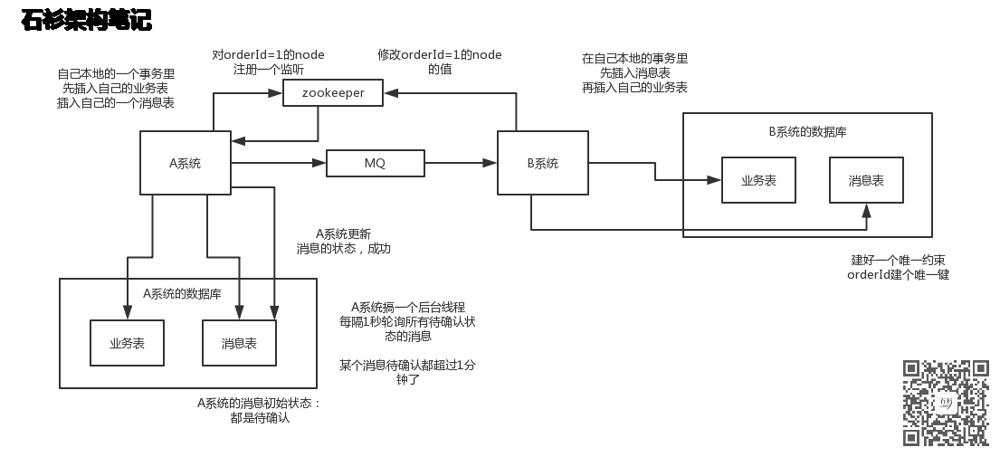

国外的ebay搞出来的这么一套思想

## 这个大概意思是这样的
1）A系统在自己本地一个事务里操作同时，插入一条数据到消息表

2）接着A系统将这个消息发送到MQ中去

3）B系统接收到消息之后，在一个事务里，往自己本地消息表里插入一条数据，同时执行其他的业务操作，如果这个消息已经被处理过了，那么此时这个事务会回滚，这样保证不会重复处理消息

4）B系统执行成功之后，就会更新自己本地消息表的状态以及A系统消息表的状态

5）如果B系统处理失败了，那么就不会更新消息表状态，那么此时A系统会定时扫描自己的消息表，如果有没处理的消息，会再次发送到MQ中去，让B再次处理

6）这个方案保证了最终一致性，哪怕B事务失败了，但是A会不断重发消息，直到B那边成功为止

## 适用场景
这个方案说实话最大的问题就在于严重依赖于数据库的消息表来管理事务啥的？？？这个会导致如果是高并发场景咋办呢？咋扩展呢？所以一般确实很少用
