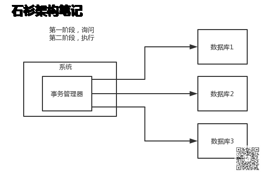

# 两阶段提交方案/XA方案
也叫做两阶段提交事务方案，这个举个例子，比如说咱们公司里经常tb是吧（就是团建），然后一般会有个tb主席（就是负责组织团建的那个人）。

tb，team building，团建
## 什么是两阶段提交方案？
### 第一个阶段
一般tb主席会提前一周问一下团队里的每个人，说，大家伙，下周六我们去滑雪+烧烤，去吗？这个时候tb主席开始等待每个人的回答，如果所有人都说ok，那么就可以决定一起去这次tb。如果这个阶段里，任何一个人回答说，我有事不去了，那么tb主席就会取消这次活动。

### 第二个阶段
那下周六大家就一起去滑雪+烧烤了

## 简单总结一下
所以这个就是所谓的XA事务，两阶段提交，有一个事务管理器的概念，负责协调多个数据库（资源管理器）的事务，事务管理器先问问各个数据库你准备好了吗？如果每个数据库都回复ok，那么就正式提交事务，在各个数据库上执行操作；如果任何一个数据库回答不ok，那么就回滚事务。

## 适用场景
这种分布式事务方案，比较适合单块应用里，跨多个库的分布式事务，而且因为严重依赖于数据库层面来搞定复杂的事务，效率很低，绝对不适合高并发的场景。如果要玩儿，那么基于spring + JTA就可以搞定，自己随便搜个demo看看就知道了。

这个方案，我们很少用，一般来说某个系统内部如果出现跨多个库的这么一个操作，是不合规的。我可以给大家介绍一下， 现在微服务，一个大的系统分成几百个服务，几十个服务。一般来说，我们的规定和规范，是要求说每个服务只能操作自己对应的一个数据库。

如果你要操作别的服务对应的库，不允许直连别的服务的库，违反微服务架构的规范，你随便交叉胡乱访问，几百个服务的话，全体乱套，这样的一套服务是没法管理的，没法治理的，经常数据被别人改错，自己的库被别人写挂。

如果你要操作别人的服务的库，你必须是通过调用别的服务的接口来实现，绝对不允许你交叉访问别人的数据库！
